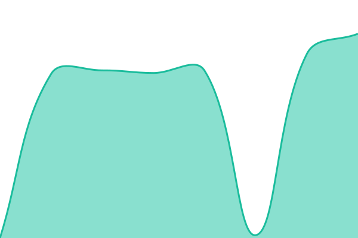

# [📈 Live Status](https://NomadCrew.github.io/status): <!--live status--> **🟩 All systems operational**

This repository contains the open-source uptime monitor and status page for [Nomad Crew](https://nomadcrew.uk), powered by [Upptime](https://github.com/upptime/upptime).

With [Upptime](https://upptime.js.org), you can get your own unlimited and free uptime monitor and status page, powered entirely by a GitHub repository. We use [Issues](https://github.com/NomadCrew/status/issues) as incident reports, [Actions](https://github.com/NomadCrew/status/actions) as uptime monitors, and [Pages](https://NomadCrew.github.io/status) for the status page.

<!--start: status pages-->
<!-- This summary is generated by Upptime (https://github.com/upptime/upptime) -->
<!-- Do not edit this manually, your changes will be overwritten -->
<!-- prettier-ignore -->
| URL | Status | History | Response Time | Uptime |
| --- | ------ | ------- | ------------- | ------ |
|  [Backend API (DB, Redis, migrations)](https://api.nomadcrew.uk/health/readiness) | 🟩 Up | [backend-api-db-redis-migrations.yml](https://github.com/NomadCrew/status/commits/HEAD/history/backend-api-db-redis-migrations.yml) | 

 779ms
     
 | 

<a href="https://NomadCrew.github.io/status/history/backend-api-db-redis-migrations">100.00%</a>
    

|  [API routing and auth](https://api.nomadcrew.uk/v1/trips) | 🟩 Up | [api-routing-and-auth.yml](https://github.com/NomadCrew/status/commits/HEAD/history/api-routing-and-auth.yml) | 

 661ms
     
 | 

<a href="https://NomadCrew.github.io/status/history/api-routing-and-auth">100.00%</a>
    

|  [Supabase auth](https://kijatqtrwdzltelqzadx.supabase.co/auth/v1/health) | 🟩 Up | [supabase-auth.yml](https://github.com/NomadCrew/status/commits/HEAD/history/supabase-auth.yml) | 

 467ms
     
 | 

<a href="https://NomadCrew.github.io/status/history/supabase-auth">76.82%</a>
    

|  [Landing site](https://nomadcrew.uk) | 🟩 Up | [landing-site.yml](https://github.com/NomadCrew/status/commits/HEAD/history/landing-site.yml) | 

 218ms
     
 | 

<a href="https://NomadCrew.github.io/status/history/landing-site">100.00%</a>
    

|  [Landing functions (image proxy)](https://nomadcrew.uk/api/unsplash) | 🟩 Up | [landing-functions-image-proxy.yml](https://github.com/NomadCrew/status/commits/HEAD/history/landing-functions-image-proxy.yml) | 

 232ms
     
 | 

<a href="https://NomadCrew.github.io/status/history/landing-functions-image-proxy">100.00%</a>
    

|  [Umami analytics](https://nomadcrew-umami.fly.dev/script.js) | 🟩 Up | [umami-analytics.yml](https://github.com/NomadCrew/status/commits/HEAD/history/umami-analytics.yml) | 

 16340ms
     
 | 

<a href="https://NomadCrew.github.io/status/history/umami-analytics">100.00%</a>
    

|  [Coolify deploy endpoint](https://coolify.nomadcrew.uk) | 🟩 Up | [coolify-deploy-endpoint.yml](https://github.com/NomadCrew/status/commits/HEAD/history/coolify-deploy-endpoint.yml) | 

 795ms
     
 | 

<a href="https://NomadCrew.github.io/status/history/coolify-deploy-endpoint">100.00%</a>
    

<!--end: status pages-->

[**Visit our status website →**](https://NomadCrew.github.io/status)

## 📄 License

- Powered by: [Upptime](https://github.com/upptime/upptime)
- Code: [MIT](./LICENSE) © [Anand Chowdhary](https://anandchowdhary.com)
- Data in the `./history` directory: [Open Database License](https://opendatacommons.org/licenses/odbl/1-0/)
